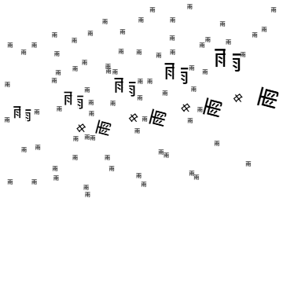
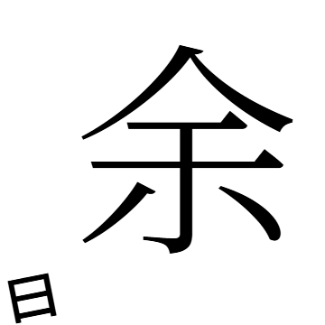

# ことばのかたち

入力されたことばを、文字の形、音、語や文の構造、文字どうし・語どうしの関係、
意味など複数の側面から読み、一枚の視覚詩へ変換するWeb作品。

**[作品を見る → kotoba-no-katachi.pages.dev](https://kotoba-no-katachi.pages.dev/)**

<p align="center">
  <a href="https://kotoba-no-katachi.pages.dev/?title=%E5%AD%A4%E7%8B%AC&v=3"></a>
  <a href="https://kotoba-no-katachi.pages.dev/?title=%E9%9B%A8%E3%81%AE%E4%B8%AD%E3%81%AE%E9%9B%A8&v=3"></a>
  <a href="https://kotoba-no-katachi.pages.dev/?title=%E4%BD%99%E7%99%BD&v=3"></a>
</p>
<p align="center"><sub>孤独 ・ 雨の中の雨 ・ 余白</sub></p>

同じことばからは、いつも同じ一枚が生まれます。

---

## 作品について

ことばは、意味だけでできているわけではありません。

文字には形があり、音があります。並べれば配置が生まれ、繰り返せば反復が、
欠ければ欠落が、離せば距離が、何もないところには空白が生まれます。ふだん
ことばを読むとき、私たちはそれらをほとんど意識せず、意味だけを受け取って
通り過ぎています。

この作品は、入力された短いことば——ひとつの語、題のような句、短い呼びかけ——
を、その意味だけでなく、字の形、音、語の構造、字と字の関係からも読み取り、
その読みを紙面として返します。

あらかじめ用意されたデザインにことばを当てはめるのではありません。読み取った
特徴は、ことばそのものに対する操作——繰り返す、離す、分ける、欠けさせる、
傾ける、集める、余白をあける——として実行され、その結果として残ったものが
紙面になります。紙面に現れるのは、入力された字と、その字の中に見つかる形
（森の中の木のような）だけです。意味は絵として描かれることはなく、操作の強さや
向きに、目に見えない力として働きます。

### コンクリート・ポエトリーと新國誠一

本作を考えるうえで、コンクリート・ポエトリー、とりわけ新國誠一による視覚詩の
実践を参照しています。言葉を意味の伝達手段としてだけでなく、文字の形、音、
配置、反復、空白を含む素材として扱うその問題意識を踏まえつつ、本作では
字形の計測、語や文字の関係の解析、意味の読み取りを通して、現在の計算環境から
別の方法を試みています。特定の作品を再現したり、様式を模倣したりすることは
目的としていません。

### ことばを読む装置としてのコンピュータ

ここでのコンピュータは、図を描くための道具というより、**ことばを読むための
ひとつの装置**です。システムがことばを読み、その読解の結果を紙面として返す。
読み方は人間の読み方とは違いますが、字の墨の量や重心、字の中にある別の字、
音の繰り返し、語と語のつながり、といった、ふだん見過ごしている側面を拾い
上げます。

### 同じことばには、同じ一枚

いま、text → image という入力と出力の関係は、生成AIによる確率的な生成と
結びつけて考えられることが多くなっています。

本作ではあえて、独自の決定的なアルゴリズムによって、**同じ入力・同じ版には、
必ず同じ一枚**を対応させています。生成し直すことも、候補から選ぶこともでき
ません。ふたつの紙面が違うのは偶然ではなく、入力されたことばが違うからです。

これはAI批判ではありません。確率的な生成が一般的になった時代だからこそ、
一対一の写像、決定的なアルゴリズムの硬さや美しさを、あらためて考えてみたい
という位置づけです。

---

## 使い方

- 白い紙の下の一行にことばを入れて Enter。16字まで。
- 読みを指定するときは 「子供の城（こどものしろ）」 のように括弧で添えます。
- 紙面ごとに固有のアドレスがあります（例 `/?title=孤独&v=3`）。共有された
  アドレスは、いつ開いても同じ紙面を描きます。
- 保存（PNG）・共有（X・その他・コピー）・別のことばで試す、だけがあります。

---

## しくみ

ここから先は、どう読んでいるかに関心のある人のための説明です。

### 流れ

```
ことば（題・読み・版）
  │
  ├─ 言語の読み   字・かな・語・モーラ・音の特徴、反復・対・入れ子・否定・係り受け
  ├─ 字形の読み   同梱フォントの字を実際に描いて測る：墨の量・重心・部品・余白、
  │               字の中にある別の字（森の中の木）
  └─ 意味の読み   固定の表から9つの軸の値を引く（群れ・動揺・囲い・断絶・消失・
                  距離・重さ・下降・抽象）
  ↓
競い合う操作（acts）   間があく／ひとつの字が離れる／字が自分の部品で欠けていく
                       ／傾く／字の継ぎ目で割れる — いちばん強い読みが紙面を主導し、
                       他は退く
  ↓
図（figure）   ことばを一本の線に沿って書く：直線 → 弧 → 環、角・枝分かれ、
               何行書くか
紙（paper）    どれだけ大きく、どこに置き、端で切るか
素材（material） ことば自身の字からできた小さな印（主導する操作に譲る）
韻（motif）    反復・対・入れ子・欠落などの構造が、似た紙面どうしを近づける
  ↓
SVG（画面） / canvas → PNG（保存・共有）
```

- どの操作が起きるかは、ひとつの特徴で決まるのではなく、すべての読みの強さ
  から決まります。**どの字が離れるか、どこで割れるか、どちら側が欠けるか、
  どちらへ傾くか**という「形」は、常に字形・音・構造から来ます。意味が動かす
  のは、操作の強さ、紙の上での大きさと位置、素材の量だけで、図として描かれる
  ことはありません。
- 偶然に見える部分は、題と読みから計算した種（seed）による擬似乱数です。
  同じ題・読み・版なら、同じ数列、同じ紙面になります。
- 紙面に書かれるのは入力された字と、字形の読みがその中に見つけた部品だけ
  です。関連語や記号を足すことはしません（`docs/research/v3-notes.md` の
  実験で採らなかった方法です）。
- 紙面は満たすべき条件を持っています：字が失われない、読む順が崩れない、
  字どうしが重ならない、字でないものが字の墨に乗らない
  （`src/poem/form/invariants.ts`）。

### 意味の扱い

- 学習済みの言語モデルは使っていません。実行時に動くモデルもありません。
- 意味は、日本語の単語ベクトル [chiVe](https://github.com/WorksApplications/chiVe)
  （v1.3 mc90, Works Applications, Apache License 2.0）から一度だけ導いた
  固定の表として同梱しています：62,653語（頻出6万語とすべての単漢字）× 9軸、
  各6ビット。字の先頭で64の断片に分け、題が必要とする断片だけを読み込みます
  （`public/semantic/axes-1/`, 各8–17 KB）。
- 9つの軸は、それぞれ両端を表す二組の名詞で定義し（検討に使った題の語は
  含めない）、ベクトル空間の共通成分を取り除いたうえで互いに直交させ、
  ふつうの2–3字熟語に対して標準化しています。題は長い語から順に表と照合し、表にない語は漢字ごとに読みます
  （群衆 → 群・衆）。
- 表は `tools/semantic/axes.py` と `shard.py` で同じファイルからビット単位で
  同一に作り直せます。各断片の sha256 は `meta.json` にあります。
- 詳しくは `docs/release-v3.md`。

### 版と再現性

| アドレス | 版 |
| --- | --- |
| `/?title=…&v=3` | v3 — 現在ルートから書かれる紙面（2026-09-24 JST 公開） |
| `/?title=…`（版なし） | v2c — v3 以前に共有されたすべてのアドレス |
| `/?title=…&v=1` | v1 |

- 公開された版は二度と変更しません。v3 の出力を変える変更は v4 になります
  （`src/poem/generators.ts`）。
- v3 は、そのコード、同梱フォント（Noto Sans JP / Noto Serif JP、npm の
  版は `package-lock.json` で固定）、意味表 `axes-1` の三つでできています。
- 回帰検査：v3 は 170 題の紙面（字の位置・大きさ・角度・切り取りまで）が
  公開時と完全に一致すること、v1 と v2c は公開当時のコードと同じ紙面を描くことを
  確かめています（`tools/form/`, `docs/release-v3.md`）。
- 字形の計測はブラウザが同梱フォントを canvas に描いて行います。検査は
  Chromium で行っています。

### 構成

```
index.html, src/main.ts, src/style.css   公開ページ（紙・一行・作例・About）
src/title.ts                             題の正規化と種
src/language/                            言語の読み（規則による分かち書き、かな・モーラ・音）
src/language/semantic/                   意味の表の読み込みと照合
src/glyph/                               字形の計測・部品・字どうしの関係
src/poem/generators.ts                   版ごとの生成器の固定（v1 / v2c / v3）
src/poem/compose.ts                      読みから紙面へ
src/poem/parametric/                     v3：acts・trace（図）・paper・material・motif
src/poem/form/invariants.ts              紙面が満たすべき条件
src/render/                              SVG と PNG
functions/, server/, migrations/          匿名の生成記録（Cloudflare Pages Functions + D1）
tools/                                   検査・シート・意味表の再構築・作例の描画
docs/                                    版ごとの記録、研究の過程（docs/research/）
```

`study.html` / `review.html` は開発用のシートで、公開ページには含まれません。

---

## 開発

```bash
npm ci
npm run dev        # http://localhost:5173
npm run build      # 型検査 + dist/
```

- 作例のサムネイルとリンク画像は `tools/examples/make.mjs` が公開版の生成器で
  描き、`CHECK=1` で実際の出力と一致することを確かめます。
- 生成の記録（`functions/`）は `npm run dev:archive`（wrangler pages dev、
  ローカルDB）で動きます。先に `wrangler.example.toml` を `wrangler.toml` に
  写し、自分の D1 の id を入れてください。記録の内容と扱いは `docs/archive.md`。
- 公開手順と巻き戻しは `docs/release.md`、`docs/release-v3.md`。

---

## ライセンスと出典

- **ソースコード**：MIT License（`LICENSE`）
- **作品**：作品名「ことばのかたち」、作品についての文章、作例・OGP・
  コンタクトシートなどの画像は権利を留保しています（`LICENSE-ASSETS.md`）。
  ご自身で開いた・つくった作品の画像は、作品名とその作品の URL を添えて、
  個人の SNS などで共有できます。

同梱・派生しているもの：

- 字体：Noto Sans JP / Noto Serif JP — SIL Open Font License 1.1
  （npm `@fontsource/noto-sans-jp`, `@fontsource/noto-serif-jp` から配布）
- 意味の表 `public/semantic/axes-1/` — chiVe v1.3 mc90（Copyright (c) 2024 Works
  Applications Co., Ltd.）から導いた表。Apache License 2.0
  （同じディレクトリの `LICENSE-chiVe.txt`, `NOTICE.txt`）
- 研究用の近傍表 `src/language/semantic/data/` — 青空文庫（パブリックドメイン）の
  コーパス `globis-university/aozorabunko-clean`（CC BY 4.0）と chiVe から導いた
  統計。公開ページでは使っていません（`NOTICE.md`）

制作：Yuki Sunaga
