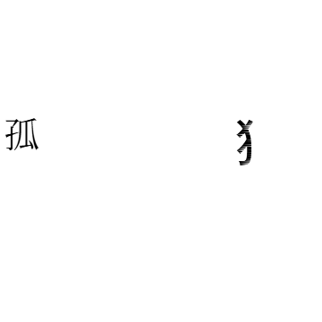
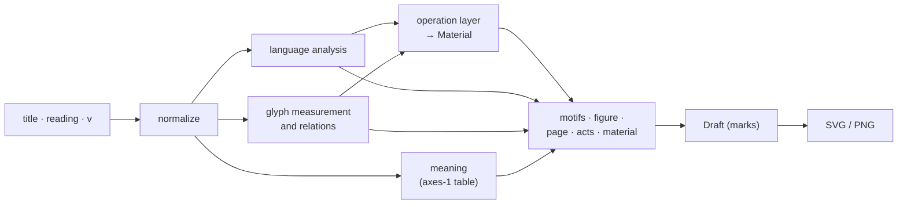

# ことばのかたち

入力されたことばを、文字の形、音、語や文の構造、文字どうし・語どうしの関係、意味から読み取り、一枚の視覚詩に変換するWeb作品です。コンクリート・ポエトリー、とくに新國誠一の視覚詩を参照しています。

**[作品を見る → kotoba-no-katachi.pages.dev](https://kotoba-no-katachi.pages.dev/)**

<p align="center">
  <a href="https://kotoba-no-katachi.pages.dev/?title=%E5%AD%A4%E7%8B%AC&v=1"></a>
  <a href="https://kotoba-no-katachi.pages.dev/?title=%E9%9B%A8%E3%81%AE%E4%B8%AD%E3%81%AE%E9%9B%A8&v=1"></a>
  <a href="https://kotoba-no-katachi.pages.dev/?title=%E4%BD%99%E7%99%BD&v=1"></a>
</p>
<p align="center"><sub>孤独 ・ 雨の中の雨 ・ 余白</sub></p>

同じことばには、同じ一枚があります。

---

## システムの概要

このリポジトリは作品のソースコードです。作品の一般向けの説明はサイトの About にあります。ここでは仕組みを説明します。

- 題（最大16字）と任意の読み、版（`v`）から、決定的に一枚の紙面（`Draft`：字の位置・大きさ・角度・切り取りの列）を生成し、SVG と PNG に描きます。サーバー側の生成も、実行時の機械学習モデルもありません。すべてブラウザ内で計算します。
- 読み取るのは次のものです。
  - **言語**：規則による分かち書き、かな・モーラ・音韻特徴、反復・対・係り受け・否定などの関係
  - **字形**：同梱フォントの字を canvas に描いて測った墨の量・継ぎ目・部品、字どうしの包含と類似
  - **意味**：chiVe から一度だけ作った固定の9軸の表
- 紙面は二段階でできます。まず operation layer（提案・特徴の降下・主操作・修飾）が題を読み、`Material` を作ります。次にパラメトリックな生成器がそれを配置します。生成器は、図（一本の曲線と行数）、紙面（大きさ・位置・向き）、互いに競合する行為（間・離れ・摩耗・傾き・分割）、素材（字自身の小さな複製）、韻（構造が共通する題どうしを近づける引力）からなります。
- 乱数の種は題・読み・variant から作ります。種が決めるのは、曲線が曲がる向きの一つだけです。
- 公開した版は変更しません。現在の版は v1 で、アドレスには常に `v=1` を書きます。131題の公開 fixture で、出力が記録と一致することを検証できます。

## 全体の流れ



## 技術ドキュメント

| 文書 | 内容 |
| --- | --- |
| [docs/architecture.md](docs/architecture.md) | 1ページができるまでの全体像、各段階とモジュール、データ型、描画（SVG / PNG） |
| [docs/reading.md](docs/reading.md) | 入力とアドレス、正規化、分かち書き、読みの対応づけ、モーラと音韻、関係、書字方向、字形の計測・部品・判読・包含と類似・内部の白 |
| [docs/semantics.md](docs/semantics.md) | 意味の表の作り方（all-but-the-top、軸の定義、抽象軸に対する直交化、正規化、int8 と 6 bit の量子化、64 分割）と実行時の読み方、極への変換 |
| [docs/composition.md](docs/composition.md) | 生成器：operation layer、韻（motif と chord）、図・行・紙面のパラメータ、行為の競合（economy）、配置と切り取り、素材、書体 |
| [docs/reproducibility.md](docs/reproducibility.md) | 種の役割、紙面が依存するもの、版の固定、検証（fixture と不変条件の監査）、制約と失敗時の挙動 |
| [docs/site.md](docs/site.md) | ビルドと公開、共有とリンクプレビュー、アイコン、匿名の生成記録（Cloudflare Pages Functions + D1）と /admin |

## 再現と開発

```bash
npm ci
npm run dev          # http://localhost:5173
npm run build        # 型検査 + dist/
npm test             # 単体テスト：生成記録・/admin・共有・読み・SVG の検査
npm run verify       # 公開 fixture の検証：131題が tools/verify/expected.json と一致するか
```

- `npm run verify` は Vite と headless Chrome を起動します。Chrome の場所は環境変数 `CHROME` で指定できます。どれか一つでも違えば終了コード 1 になります。
- v1 の出力は次のものに固定されています。
  - コード（タグ `v1.0.0`）
  - フォント（`@fontsource/noto-sans-jp` と `noto-serif-jp` の 5.3.0。`package-lock.json` で固定）
  - 意味の表 `public/semantic/axes-1/`（各断片の sha256 を `meta.json` に記録）
- 字形はブラウザの canvas で測るため、出力は描画エンジンに依存します。fixture は Chromium で作成・検証しています（[制約](docs/reproducibility.md#limitations-and-failure-modes)）。
- 意味の表は、同じ chiVe のファイルから `tools/semantic/axes.py` と `shard.py` でビット単位で同一に作り直せます。
- 生成記録をローカルで動かすには、`wrangler.example.toml` を `wrangler.toml` にコピーして自分の D1 の id を入れ、`npm run dev:archive` を実行します。

```
src/            ページ、生成器（language / glyph / poem）、描画、記録のクライアント側
src/study/      検証用の公開タイトルセット（サイトで入力された題は含みません）
functions/, server/, migrations/   共有用アドレスと生成記録（Pages Functions + D1）
tests/          単体テスト
tools/verify/   検証：headless Chrome ドライバ、fixture、expected.json
tools/semantic/ 意味の表の作成スクリプト
tools/examples/, tools/icons/      作例・OGP 画像・アイコンの描画
public/         意味の表、作例、OGP 画像、アイコン
docs/           技術ドキュメント
```

## ライセンスと出典

- **ソースコード**：MIT License（`LICENSE`）
- **作品**：作品名「ことばのかたち」、作品についての文章、作例・OGP・アイコンなどの画像は、権利を留保しています（`LICENSE-ASSETS.md`）。ご自身で開いた、またはつくった作品の画像は、作品名とその作品の URL を添えて、個人の SNS などで共有できます。

同梱・派生しているもの：

- 字体：Noto Sans JP / Noto Serif JP（SIL Open Font License 1.1。npm の `@fontsource/noto-sans-jp`、`@fontsource/noto-serif-jp` から配布）
- 意味の表 `public/semantic/axes-1/`：chiVe v1.3 mc90（Copyright (c) 2024 Works Applications Co., Ltd.）から導いた表。Apache License 2.0（同じディレクトリの `LICENSE-chiVe.txt`、`NOTICE.txt`）

制作：Yuki Sunaga
