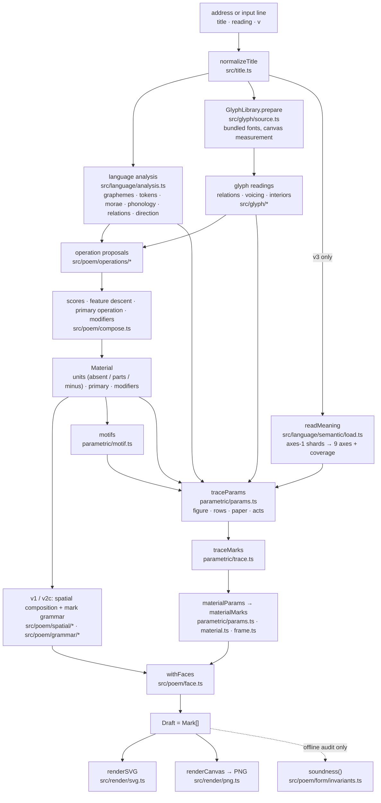

# Architecture

This document follows one title from the address bar to the drawn page, names
the module that does each step, and says which steps belong to which published
generator. The details of each stage are in [reading.md](reading.md) (input,
language, glyphs), [semantics.md](semantics.md) (the meaning table),
[composition.md](composition.md) (the v3 generator) and
[reproducibility.md](reproducibility.md) (seed, versions, verification,
limitations).

## One page, end to end



The page (`src/main.ts`) does, for every poem:

1. `normalizeTitle` → `analyze(input)` (`src/poem/compose.ts`), which runs
   the language analysis and loads and measures every glyph it needs.
2. `write(analysis, version)` (`src/poem/generators.ts`), which returns a
   `Composition` whose `draft.marks` is the page.
3. `renderSVG` to the screen, and `renderCanvas` for the PNG that 保存 and
   その他 hand over.

## The three published generators

All three are the same function, `compose(analysis, force)`, called with a
fixed `Force` (`src/poem/generators.ts`):

| version | address | call |
| --- | --- | --- |
| v1 | `?v=1` | `compose(a, {})` |
| v2c | no `v` parameter | `compose(a, { grammar: 'auto' })` |
| v3 | `?v=3` | `compose(a, { parametric: 'auto', meaning: await readMeaning(text) })` |

`compose()` always runs the whole of its first half — proposals, feature
descent, primary operation, modifiers, the spatial compositions' offers and the
chosen composition's `realize()`, and `writeWith()` for the grammar — and only
then decides what the page's marks are:

```ts
// src/poem/compose.ts (abridged)
const drawn4 = force.parametric ? parametricPage(a, material, …, force.meaning) : null
const behaved = writeWith(force.grammar, a, material, drawn, placed, …)
draft.marks = withFaces(a, material, force.parametric ? drawn4.marks : behaved.marks)
```

So:

- **v3 depends on the operation layer.** The `Material` it draws is the
  output of the v1 operation layer: which units are blanked (`absent`, from
  absence), which arrive split into parts (`parts`, decomposition as a
  modifier) or with another glyph subtracted (`minus`, transformation as a
  modifier), and the primary operation's `focus` and `poeticPotential`, which
  set the page scale, the enlarged subject, the face and the `nesting` motif
  ([composition.md](composition.md#1-the-operation-layer)).
- **In v3, the spatial composition and the mark grammar are computed and
  discarded.** Their results remain in the returned `Composition`
  (`spatial`, `scale`, `parameters`, `contract`, `grammar`) but do not reach
  the page. The `form: 'v3'` deformation (`src/poem/form/*`) is a research path
  that no published generator enables.
- **The shared modules are frozen for every version at once.** A change to
  the language analysis, the glyph readings, the operations, the spatial
  compositions or the grammars can change v1, v2c and v3 together
  ([reproducibility.md](reproducibility.md#versions-and-the-frozen-boundary)).

## Data at each step

| type | where | what it holds |
| --- | --- | --- |
| `TitleInput` | `src/title.ts` | `text` (NFC, one line, ≤ 16 code points), `reading?` (hiragana), `variant` (always 0 on the site) |
| `LanguageAnalysis` | `src/language/analysis.ts` | graphemes with script, tokens with part of speech, `tokenOf`, morae, phonological features, `readingAligned`, `direction`, relations |
| `Analysis` | `src/poem/types.ts` | the above + `glyphs` (GlyphLibrary), `glyphRelations`, `readables`, `voicing`, `interiors` |
| `Proposal` | `src/poem/types.ts` | an operation's reading of the title: `focus`, `level`, `origin`, `linguisticSalience`, `visualPotential`, `poeticPotential`, `roles` |
| `Unit` | `src/poem/types.ts` | one grapheme to be written: `char`, `grapheme`, `token`, and optionally `absent`, `parts`, `minus` |
| `Material` | `src/poem/types.ts` | `tokens: Unit[][]`, `primary`, `modifiers` |
| `Mark` | `src/poem/types.ts` | one glyph on the page: `char`, `x`, `y` (page units, the glyph's ink centre), `size` (em size in page units), `rotate` (degrees), `face`, `keep` (clip rectangles in em space), `shift`, `minus`, `grapheme`, `derived`, `role`, `represents` |
| `Draft` | `src/poem/types.ts` | `{ marks: Mark[] }` — the whole output of a generator |

Coordinates: the page is `PAGE = 1000` units square (`src/render/stage.ts`);
a glyph's em square is `EM = 100` units (`src/glyph/font.ts`); every glyph is
drawn with its **ink centre** at the origin of its em space, not its pen
origin, so `(x, y)` is where the middle of the ink stands.

## Rendering

Rendering is a straight replay of the `Draft`; it makes no decisions.

- **SVG** (`src/render/svg.ts`, `src/render/stage.ts`, `src/glyph/figure.ts`):
  an `<svg viewBox="0 0 1000 1000">` whose content is clipped to the page
  (the page edge crops like the edge of paper). Each mark is a `<text>` element
  in the bundled web font (`font-size` 100, positioned at the glyph's pen
  offset from its ink centre) inside a `<g transform="translate rotate scale
  [translate]">` for position, rotation, scale and `shift` (positions written
  to 2 decimals, the scale to 4). `keep` becomes a `clipPath` of rectangles in em space;
  `minus` becomes a `mask` in which the subtracted glyph is drawn with a
  stroke of `2 × REMOVAL_MARGIN` (≈ 3.9 em units) so that no hairline of it
  remains.
- **PNG** (`src/render/png.ts`): the same marks drawn with `fillText` into a
  2048 × 2048 canvas (white paper, black ink), with the same transforms and
  clips; a `minus` is painted on a scratch canvas and removed with
  `destination-out` before being composited. An SVG rasterised as an image
  could not use the web font, which is why the PNG is drawn directly.
- Glyphs are text in the bundled font, not outlines: the drawn shapes are the
  browser's rasterisation of Noto Sans JP 500 / Noto Serif JP 300
  ([reproducibility.md](reproducibility.md#limitations-and-failure-modes)).

## Module map

```
src/title.ts                     input normalization, seed
src/core/random.ts               cyrb53 hash, mulberry32 generator, fork()
src/language/                    segmentation, kana, morae, phonology, relations
src/language/semantic/           the meaning table: parse, look up, fetch shards
src/language/lexicon/            a small bundled lexicon (v2 grammars only; not read by v3)
src/glyph/                       fonts, coverage, measurement, parts, legibility, relations, interiors
src/poem/compose.ts              analyze() and compose(): the whole generator
src/poem/generators.ts           the published versions and their Force
src/poem/operations/             proliferation, decomposition, transformation, absence
src/poem/potential.ts, salience.ts, scope.ts   proposal scores
src/poem/spatial/, grammar/, scale.ts           v1 / v2c page layout (computed but discarded in v3)
src/poem/parametric/             the v3 generator: params, acts, motif, trace, paper, material, frame
src/poem/face.ts                 which face each mark is written in
src/poem/form/                   invariants.ts (the audit); the rest is an unpublished research path
src/render/                      SVG and PNG
src/main.ts, index.html, style.css   the public page
src/archive/, functions/, server/, migrations/   the anonymous generation log (site.md)
src/study/                       public title sets used as regression fixtures (reproducibility.md)
```
