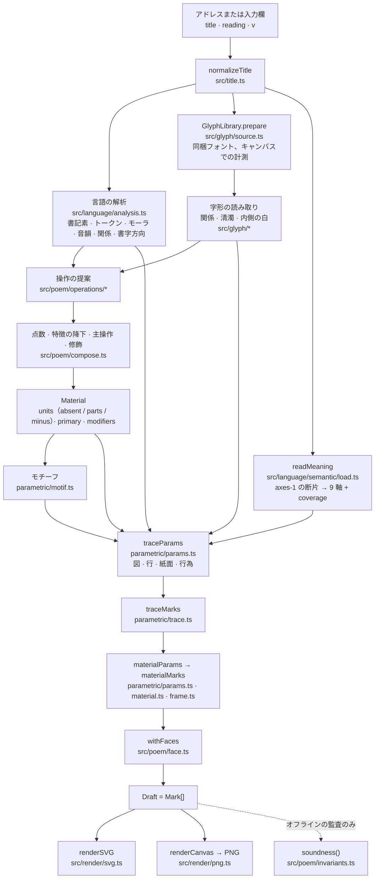

# 全体の構成

アドレスバーに入ったひとつの題が、描かれた紙面になるまでをたどり、各段階を担うモジュールを示す。各段階の詳細は、[reading.md](reading.md)（入力、言語、字形）、[semantics.md](semantics.md)（意味の表）、[composition.md](composition.md)（生成器）、[reproducibility.md](reproducibility.md)（乱数の種、版、検証、制約）に書く。

## ひとつの紙面ができるまで



ページ（`src/main.ts`）は、詩ごとに次のことをする。

1. `normalizeTitle` → `analyze(input)`（`src/poem/compose.ts`）。言語の解析を行い、必要な字形をすべて読み込んで計測する。
2. `write(analysis, version)`（`src/poem/generators.ts`）。`Composition` を返し、その `draft.marks` が紙面になる。
3. `renderSVG` で画面に描き、`renderCanvas` で「保存」と「その他」が渡す PNG を描く。

## 生成器

`write(analysis, 1)` は `compose(analysis, await readMeaning(text))` である（`src/poem/generators.ts`）。`compose()` は前半と後半に分かれる。

```ts
// src/poem/compose.ts（抜粋）
const material = /* 提案 → 降下 → 主操作 → 修飾 → Material */
const page = parametricPage(a, material, new Rng(seed).fork('parametric'), (ms) => withFaces(a, material, ms), meaning)
draft.marks = withFaces(a, material, page.marks)
```

- **操作の層が題を読む。** 出力は `Material` で、次のものを含む（[composition.md](composition.md#1-操作の層)）。
  - どの units を空白にするか（`absent`。absence による）
  - どの units を部品に分けて渡すか（`parts`。修飾としての decomposition）
  - どの units から別の字形を引くか（`minus`。修飾としての transformation）
  - 主操作の `focus` と `poeticPotential`。紙面の大きさ、大きく書く主題、字体、`nesting` モチーフを決める
- **パラメトリックな生成器がそれを描く。** モチーフ、図、紙面、行為、素材は、題と `Material` と意味から読み取った連続的なパラメータである（`src/poem/parametric/*`）。
- **紙面が読むモジュールは、すべて公開した版の一部である。** 言語の解析、字形の読み取り、操作、パラメトリックな生成器のどれを変えても、その版が書く内容は変わる（[reproducibility.md](reproducibility.md#版と凍結の範囲)）。

## 各段階のデータ

| 型 | 場所 | 中身 |
| --- | --- | --- |
| `TitleInput` | `src/title.ts` | `text`（NFC、一行、16 コードポイント以下）、`reading?`（ひらがな）、`variant`（サイトではつねに 0） |
| `LanguageAnalysis` | `src/language/analysis.ts` | 文字の種類つきの書記素、品詞つきのトークン、`tokenOf`、モーラ、音韻の特徴、`readingAligned`、`direction`、関係 |
| `Analysis` | `src/poem/types.ts` | 上のすべて + `glyphs`（GlyphLibrary）、`glyphRelations`、`readables`、`voicing`、`interiors` |
| `Proposal` | `src/poem/types.ts` | ひとつの操作による題の読み方：`focus`、`level`、`origin`、`linguisticSalience`、`visualPotential`、`poeticPotential`、`roles` |
| `Unit` | `src/poem/types.ts` | 書かれる一字：`char`、`grapheme`、`token`。場合により `absent`、`parts`、`minus` |
| `Material` | `src/poem/types.ts` | `tokens: Unit[][]`、`primary`、`modifiers` |
| `Mark` | `src/poem/types.ts` | 紙面の上の一字形：`char`、`x`、`y`（紙面の単位。字形の墨の中心）、`size`（紙面の単位での em の大きさ）、`rotate`（度）、`face`、`keep`（em 空間でのクリップの矩形）、`shift`、`minus`、`grapheme`、`derived`、`role`、`represents` |
| `Draft` | `src/poem/types.ts` | `{ marks: Mark[] }`。生成器の出力のすべて |

座標：紙面は `PAGE = 1000` 単位の正方形（`src/render/stage.ts`）、字形の em の正方形は `EM = 100` 単位（`src/glyph/font.ts`）。どの字形も、ペンの原点ではなく**墨の中心**を em 空間の原点に合わせて描くので、`(x, y)` は墨の真ん中の位置を表す。

## 描画

描画は `Draft` をそのまま再生するだけで、何も判断しない。

- **SVG**（`src/render/svg.ts`、`src/render/stage.ts`、`src/glyph/figure.ts`）
  - 中身を紙面の範囲でクリップした `<svg viewBox="0 0 1000 1000">` である。紙面の端は、紙の端のように字を切る。
  - 印はそれぞれ、同梱の Web フォントの `<text>` 要素（`font-size` 100。墨の中心から見た字形のペンの位置に置く）で、位置・回転・倍率・`shift` のための `<g transform="translate rotate scale [translate]">` の中に入る。位置は小数第 2 位、倍率は第 4 位まで書く。
  - `keep` は em 空間の矩形の `clipPath` になる。
  - `minus` は `mask` になる。取り除く字形を `2 × REMOVAL_MARGIN`（≈ 3.9 em 単位）の線で描き、細い線が残らないようにする。
- **PNG**（`src/render/png.ts`）
  - 同じ印を、同じ変換とクリップで、2048 × 2048 のキャンバスに `fillText` で描く（白い紙、黒い墨）。
  - `minus` は作業用のキャンバスに描き、`destination-out` で取り除いてから重ねる。
  - SVG を画像として描くと Web フォントを使えないので、PNG は直接描く。
- 字形はアウトラインではなく、同梱フォントの文字として描く。描かれる形は、ブラウザが Noto Sans JP 500 / Noto Serif JP 300 を描いた結果である（[reproducibility.md](reproducibility.md#制約と失敗時の挙動)）。

## モジュールの地図

```
src/title.ts                     入力の正規化、乱数の種
src/core/random.ts               cyrb53 ハッシュ、mulberry32 生成器、fork()
src/language/                    分かち書き、かな、モーラ、音韻、関係
src/language/semantic/           意味の表：解析、検索、断片の取得
src/language/lexicon/            同梱の小さな語彙：題の字と一緒に準備する字
src/glyph/                       フォント、字の範囲、計測、部品、判読、関係、内側の白
src/poem/compose.ts              analyze() と compose()：生成器の全体
src/poem/generators.ts           公開した版と、アドレスが指す版
src/poem/operations/             proliferation、decomposition、transformation、absence
src/poem/potential.ts, salience.ts, scope.ts   提案の点数
src/poem/units.ts                Material の unit を印にする
src/poem/parametric/             params、acts、motif、trace、paper、material、frame
src/poem/face.ts                 印ごとの字体
src/poem/invariants.ts           紙面が決して破ってはならないことの監査
src/render/                      SVG と PNG
src/main.ts, index.html, style.css   公開ページ
functions/s.ts, server/share.ts  共有用のアドレスとリンクプレビュー（site.md）
src/archive/, functions/, server/, migrations/   匿名の生成記録（site.md）
src/study/                       回帰テストの fixture に使う公開タイトルセット（reproducibility.md）
```
