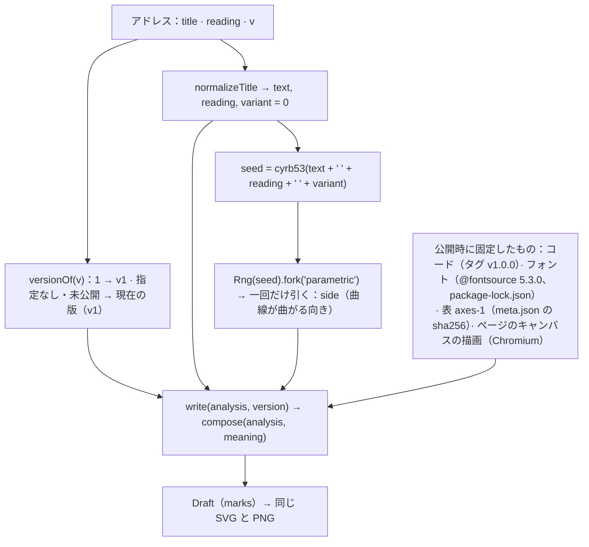

# 決定性、版、検証

同じ題、同じ読み、同じ版からは、いつも同じ紙面ができる。この文書では、それが何によって成り立っているか、どう確かめるか、どこまでしか保証しないかを書く。



## 乱数の種

`titleSeed(input) = hash(text + " " + reading + " " + variant)`（`src/title.ts`）。`hash` は 32 ビットに畳んだ cyrb53、乱数の生成器は mulberry32 である（`src/core/random.ts`）。`fork(label)` は独立した乱数列 `Rng(hash(seed + ":" + label))` を作るので、ある規則が乱数を引いても、ほかの規則の乱数はずれない。

- **版は種に含めない。** `v` はどの生成器を動かすかを選ぶだけで、ひとつの題のどの版も同じ種から始まる。
- **読みは種に含める。** 読みを添えると、音の読み取りと一緒に種も変わる。
- **種が決めるのは一つだけである。** 曲線が曲がる向き `side` である（`rng.next() < 0.5 ? +1 : −1`、`parametric/params.ts`）。紙面のほかの値は、すべて読み取りから決まる。素材の配置には乱数を使わず、固定の順序付きディザと、格子の座標の固定の整数ハッシュを使う。

## 紙面が依存するもの

1. 正規化した入力（text、reading）と版
2. 公開した生成器のコード：`write()`（`src/poem/generators.ts`）と、`compose()` が読むすべてのもの
3. フォント：字形の計測は、`@fontsource` 5.3.0 として同梱した Noto Sans JP 500 と Noto Serif JP 300 で行う
4. 意味の表 `axes-1`：断片は `public/semantic/axes-1/meta.json` の sha256 で固定している
5. ブラウザの文字の描画（[制約と失敗時の挙動](#制約と失敗時の挙動)を参照）

時刻、端末の言語設定やフォント、ウィンドウの大きさ（紙面は 1000 単位の自前の座標で描く）、それまでに見た紙面、サイト自身のファイル以外のネットワーク上のサービスには、何も依存しない。

## 版と凍結の範囲

| 版 | アドレス | 呼び出し |
| --- | --- | --- |
| v1 | `?v=1` | `compose(analysis, await readMeaning(text))` |

サイトは、作るアドレスすべてに版を書く（`&v=1`）。`v` のないアドレスや、公開していない版を指すアドレスは、現在の版（`src/poem/generators.ts` の `CURRENT`）で描く。

公開した版は書き換えない。書く内容を変えるときは、新しい `v` の値をもつ新しい版として `VERSIONS` に並べて加える（`server/share.ts` の写し、`src/archive/protocol.ts` の `GENERATORS`、検証の fixture にも加える）。新しいことばをどの版で書くかは `CURRENT` で決める。古い版を指すアドレスは、その版で描き続ける。

**凍結の範囲は `src/poem/parametric/` だけではない。** 次のどれを変えても、v1 が書く内容は変わりうる。

- `src/title.ts`
- `src/core/`
- `src/language/`（`semantic/` と `lexicon/` を含む）
- `src/glyph/`
- `src/poem/`（operations、点数、units、face、parametric）
- それらが読むフォントと表

描画（`src/render/`）は `Draft` を変えないが、`Draft` から描かれるものは変わる。変わったかどうかは `tools/verify` で確かめる。

タグ `v1.0.0` は、v1 を公開したときのソースを指す。その後の `main` への commit では、生成器のまわりのサイト（About、共有、アイコン、文書など）を変えることがある。その場合も、下の検証の結果は同一でなければならない。

## 検証

### 実行のしかた

```bash
npm ci
npm run verify
```

`tools/verify/run.mjs` は、Vite でリポジトリを配信し、headless Chrome を開いて（`$CHROME`、なければプラットフォームのふつうのインストール先）、ページの中で `tools/verify/fixture.mjs` を実行する。

1. `src/study/` にある公開タイトルセットのすべての題について、題を正規化し、解析し直し、公開しているすべての版で `write()` を実行する。題は、開発用 34、検証用に取り分けた 47、探り用 12、ふつうの語 24、端のケース 14 の合計 131 で、どれもサイトで訪問者が入力したものではない。
2. 紙面ごとに `sha256(JSON.stringify(draft.marks))` を求める。これは生成器の出力全体（すべての座標を倍精度のまま）のハッシュである。読める要約として、印の数と x、y、大きさの合計も添える。
3. すべての紙面について、不変条件の監査（下）を行う。
4. すべてを `tools/verify/expected.json` と比べ、結果を JSON で出力する。違いがひとつでもあるか、紙面が欠けているか、不変条件を破っていれば、終了コード 1 で終わる。

`npm run verify:write` は `expected.json` を書き直す。これは新しい版を公開するときだけに使う。公開した版について、このファイルを変えてはならない。

### `expected.json` を何と照合したか

fixture を作ったとき、二つの方法で照合した。

- 131 題すべてについて、サイトに公開したソースで描いた紙面とハッシュが一致し、各紙面の正規化した SVG もバイト単位で一致した。
- そのうち 128 題は、生成器を凍結したときの監査にも含まれていて、印のひとつひとつまで一致した（残りの 3 題は、サイトへの入力から採っていた題を置き換えるために、あとから書いた端のケースである）。

### 不変条件の監査（`src/poem/invariants.ts`）

`soundness(a, marks, o)` は、できあがった紙面について次の数を数える。

| 数 | 失敗とみなすもの |
| --- | --- |
| `lost` | 紙面にない題の字。50 % 以上が見えている印（または意図して切り取った印）で書かれておらず、粒の形でも表されておらず、詩が余白として書く字（`absent`）でもないもの |
| `disordered` | 一度ずつ書かれた二つの字が、大きいほうの大きさの 0.75 倍を超えて、読む順と逆に並んでいるもの。反復の紙面と、閉じた曲線に沿って読む図（`closure ≥ 0.35` または `rows > 1.05`）では調べない。退いた字は名前を挙げて除く |
| `overlaps` | 大きさが同程度（3 倍以内）の、書かれた二つの字の枠（大きさの 0.9 倍）が、小さいほうの 25 % を超えて重なるもの |
| `inkHits` | 粒の中心か、大きさの ±0.3 の四点のどれかが、書かれた墨（字形のラスターでアルファ値 96 超）に乗るもの |
| `crowded` | 二つの粒の枠（大きさの 0.8 倍）が 30 % を超えて重なるもの |
| `infinite` | 有限でない座標、大きさ、回転 |

fixture のすべての題で、どの数も 0 である。

**この検査はサイトでは行わない。** 生成器は紙面を見せる前に監査しない。規則は構造上つねに成り立つように作ってあり（[composition.md §11](composition.md#11-構造上つねに成り立つこと)）、監査はそれをオフラインで確かめるためのものである。

## 制約と失敗時の挙動

- **読みのない漢字には音がない。** 読みの辞書はない。訪問者が括弧で読みを添えない限り、漢字の並びは重み 2 のひとつの `unread` モーラになり、その音について（モーラ、母音、特殊モーラのくり返しなど）は何も読まない。字面に割り当てられない読みも、同じように無視する。
- **分かち書きは規則による。** トークン、品詞、並列、係りは、文字の種類の区間、短い機能語の一覧、送り仮名の語尾から決める（[reading.md](reading.md#分かち書きsegmentts)）。このパターンに当てはまらない題は、粗く分かれる。
- **字形の読み取りは、ひとつのフォントについてのものである。** 包含、類似、部品、継ぎ目、counter は、同梱した Noto Sans JP 500 の計測である。別のフォントや、このフォントの別の版なら、読み方も描く紙面も変わる。部品の一覧による探索では、字の中にずっと小さく書かれた部品は見つからない。
- **計測はブラウザの描画に依存する。** 字形は、キャンバスに文字を描いて画素を読むことで測る。二つの描画エンジン（あるいは同じエンジンの二つの版）が、同じ字形を違うアンチエイリアスで描けば、測った値が動き、閾値の近くでは判断が変わりうる。`expected.json` は **Windows 上の Chromium（headless Chrome 153）** で作って確かめた。公開サイトは iOS の Safari でも目で見て確かめたが、WebKit や Gecko でバイト単位まで一致するかは確かめていない。浮動小数点の関数（`Math.sin`、`Math.log` など）の精度はエンジンに任されていて、エンジン間で最後のビットが違う可能性がある。V8 はプラットフォームをまたいで一致する。
- **描く字形は Web フォントの文字である。** SVG はアウトラインではなく `<text>` を使うので、目に見えるのは、ブラウザがフォントを描いた結果である。
- **フォントにない字は拒否する。** 代わりのフォントでは描かない（[reading.md](reading.md#字体にある字の範囲)）。
- **フォントを読み込めなければ、紙面は描かない。** `GlyphLibrary.prepare` が例外を投げ、サイトは「紙面をつくれませんでした。もう一度お試しください。」と表示して何も描かない。
- **意味の表を読めなければ、紙面は描かない。** 断片の読み込みに失敗すると `readMeaning` が例外を投げ、ページは同じ文を表示する。失敗は覚えておかないので、もう一度試せば断片を取り直す。
- **意味の読み取りは読みを使わず**、表にある字（8 字までの日本語の語と単漢字）だけを読む。ほかの文字の題は coverage が 0 になり、字面だけから読まれる。
- **fixture が扱うのは公開タイトルセットだけである。** ありうるすべての題ではない。セットの外の題にだけ影響する変更は、検証を通ってしまう。セットは、生成器が読む構造（反復、組、入れ子、否定、読み、長い題、ラテン文字、数字、句読点）を覆うように選んである。
