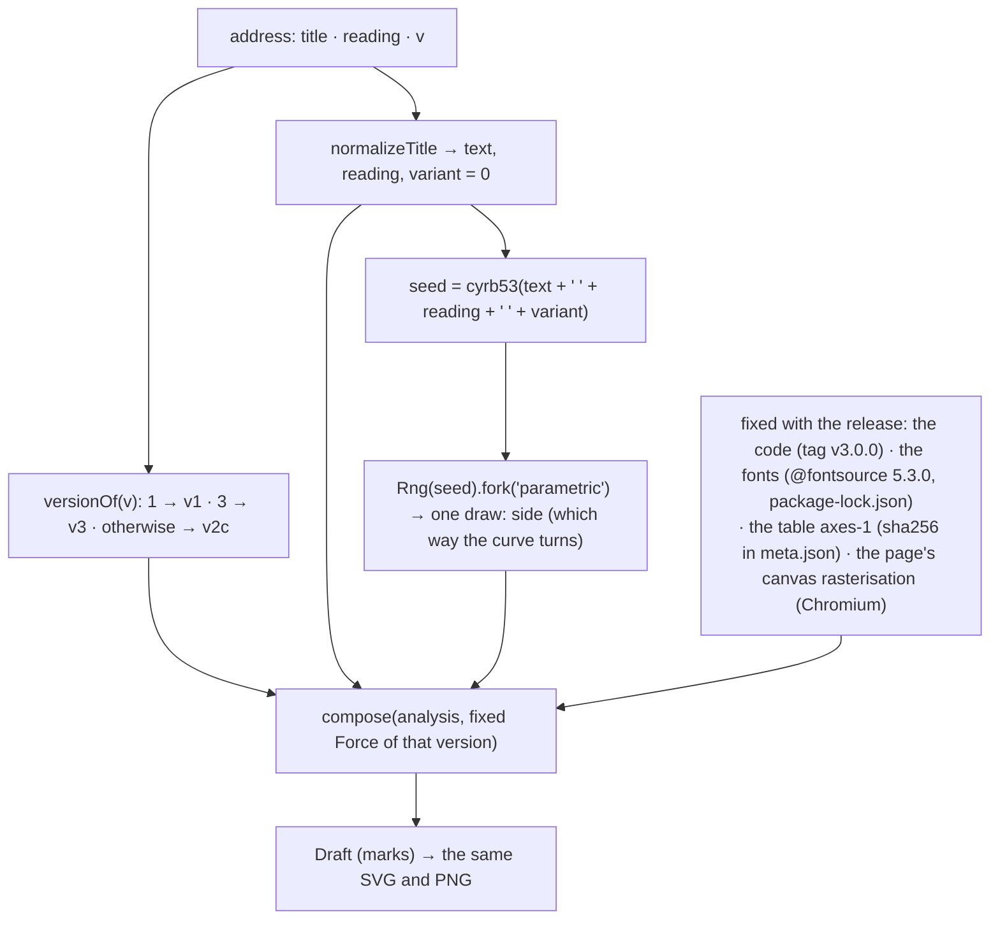

# Determinism, versions and verification

The same title, reading and version always give the same page. This document
says exactly what that rests on, how to check it, and where it stops.



## The seed

`titleSeed(input) = hash(text + " " + reading + " " + variant)` (`src/title.ts`),
where `hash` is cyrb53 folded to 32 bits and the generator is mulberry32
(`src/core/random.ts`). `fork(label)` makes an independent stream,
`Rng(hash(seed + ":" + label))`, so one rule's draws never shift another's.

- **The version is not part of the seed.** `v` chooses which generator runs;
  the three generators of one title start from the same seed.
- **The reading is.** Giving a reading changes the seed as well as the sound
  analysis.
- **In v3 the seed decides exactly one thing**: `side`, the direction the
  curve turns (`rng.next() < 0.5 ? +1 : −1`, `parametric/params.ts`). Every
  other value of a v3 page is a deterministic function of the readings. The
  material's placement uses a fixed ordered dither and a fixed integer hash of
  lattice coordinates, not the random generator.
- `compose()` also forks streams for the spatial composition and the mark
  grammar; they shape v1 / v2c pages, and in v3 their results are discarded.

## What a page depends on

1. The normalised input (text, reading) and the version.
2. The code of the published generators. `write()` (`src/poem/generators.ts`)
   calls the same `compose()` for every version with a fixed `Force`.
3. The fonts: glyph measurements are made from Noto Sans JP 500 and Noto
   Serif JP 300 as bundled from `@fontsource` 5.3.0.
4. For v3, the meaning table `axes-1`, whose shards are pinned by the sha256
   values in `public/semantic/axes-1/meta.json`.
5. The browser's text rasterisation (see [Limitations](#limitations-and-failure-modes)).

Nothing depends on the time, the device's locale or fonts, the window size
(the page is drawn in its own 1000-unit space), earlier pages, or any network
service other than the site's own files.

## Versions and the frozen boundary

| version | address | `Force` |
| --- | --- | --- |
| v1 | `?v=1` | `{}` |
| v2c | no `v` | `{ grammar: 'auto' }` |
| v3 | `?v=3` | `{ parametric: 'auto', meaning }` |

A published version is never edited: a change to what any of them writes is a
new version (v4) with its own `v` value, and `CURRENT` in
`src/poem/generators.ts` says which version new words are written in.

Because the three versions share `compose()`, **the frozen code is not only
`src/poem/parametric/`**. Changing any of these can change v1, v2c or v3:
`src/title.ts`, `src/core/`, `src/language/` (including `semantic/` and
`lexicon/`), `src/glyph/`, `src/poem/` (operations, scores, spatial
compositions, grammars, face, parametric), and the fonts and table they read.
Rendering (`src/render/`) does not change the `Draft` but changes what is
drawn from it. `tools/verify` is how to find out.

The tag `v3.0.0` marks the source as v3 was published (2026-09-24 JST).
Later commits on `main` change only the site around the generators (About,
sharing, icons, documentation); the verification below must stay identical.

## Verification

### Running it

```bash
npm ci
npm run verify
```

`tools/verify/run.mjs` serves the repository with Vite, opens headless Chrome
(`$CHROME`, or the usual install path of the platform), and runs
`tools/verify/fixture.mjs` in the page:

1. For every title of the public title sets in `src/study/` — 34 development
   titles, 47 held-out titles, 12 probes, 24 ordinary words and 14 edge cases,
   131 in all, none of them typed on the site by a visitor — it normalises the
   title, analyses it afresh, and runs `write()` for v1, v2c and v3.
2. Each page is reduced to `sha256(JSON.stringify(draft.marks))` — the whole
   output of the generator, every coordinate at full double precision —
   with the number of marks and the sums of x, y and size as a readable
   summary.
3. For v3 it runs the invariant audit (below).
4. It compares everything with `tools/verify/expected.json`, prints the result
   as JSON, and exits 1 on any difference, any missing page or any invariant
   failure.

`npm run verify:write` rewrites `expected.json`. It is for a new published
version only; for v1, v2c and v3 the file must not change.

### What `expected.json` was checked against

When the fixture was made, it was cross-checked in three ways:

- v1 and v2c: all 131 titles hash identically when drawn by the code that
  first published v2c (the `compose()` of that release, called directly).
- v3: all 131 titles hash identically when drawn by the source deployed as v3.
- v3: 128 of the titles were also in the audit taken when v3 was frozen; their
  pages agree mark for mark (the other three are edge cases written later to
  replace titles that had come from the site's own input).

### The invariant audit (`src/poem/form/invariants.ts`)

`soundness(a, marks, o)` counts, on a finished page:

| count | a failure is |
| --- | --- |
| `lost` | a character of the title that is not on the page: not written by a mark of which ≥ 50 % is visible (or that is clipped on purpose), not represented by a form of grains, and not one the poem writes as space (`absent`) |
| `disordered` | two characters written once each, in the wrong reading order by more than 0.75 × the larger size — skipped for repetition pages and for figures read along a closing curve (`closure ≥ 0.35` or `rows > 1.05`); a withdrawn character is named and left out |
| `overlaps` | two whole written marks of comparable size (≤ 3×) whose boxes (0.9 × size) overlap by more than 25 % of the smaller |
| `inkHits` | a grain whose centre or one of four points at ±0.3 of its size falls on written ink (alpha > 96 in the glyph's raster) |
| `crowded` | two grains whose boxes (0.8 × size) overlap by more than 30 % |
| `infinite` | any non-finite coordinate, size or rotation |

For every title of the fixture every count is 0.

**These checks do not run on the site.** v3 does not audit a page before
showing it; its rules hold by construction ([composition.md §11](composition.md#11-what-holds-by-construction)),
and the audit is how that is checked offline.

## Limitations and failure modes

- **Kanji without a reading have no sound.** There is no reading dictionary:
  unless the visitor adds a reading in brackets, a run of kanji is one
  `unread` mora of weight 2, and nothing about its sound (repetition of
  morae, vowels, special morae) is read. A reading that cannot be aligned with
  the writing is ignored the same way.
- **Segmentation is rule-based.** Tokens, parts of speech, coordination and
  dependency come from script runs, a short list of function words and
  okurigana endings ([reading.md](reading.md#segmentation-segmentts)). Titles
  outside those patterns are segmented coarsely.
- **Glyph readings belong to one font.** Containment, similarity, parts,
  seams and counters are measurements of Noto Sans JP 500 as bundled. Another
  font, or another version of this one, would read differently and draw
  different pages. The inventory search cannot find components much smaller
  than their own size inside a character.
- **Measurement depends on the browser's rasterisation.** Glyphs are measured
  by drawing text into a canvas and reading the pixels. Two rendering engines
  (or two versions of one) may antialias the same glyph differently, which can
  move a measured value and, near a threshold, change a decision.
  `expected.json` was produced and checked in **Chromium (headless Chrome
  153) on Windows**; the published site has been checked visually on iOS
  Safari, but byte-identical output in WebKit or Gecko has not been verified.
  Floating-point functions (`Math.sin`, `Math.log`, …) are specified to the
  engine's precision and could differ in the last bit between engines; V8 is
  consistent across platforms.
- **The drawn glyphs are text in a web font.** The SVG uses `<text>`, not
  outlines, so what the eye sees is the browser's rendering of the font.
- **Characters the fonts do not have are refused**, not drawn in a fallback
  font ([reading.md](reading.md#coverage)).
- **If the fonts cannot be loaded, no page is drawn.** `GlyphLibrary.prepare`
  throws; the site says 「紙面をつくれませんでした。もう一度お試しください。」
  and draws nothing.
- **If the meaning table cannot be read, no v3 page is drawn.** A shard that
  fails to load makes `readMeaning` throw; the page shows the same message.
  The failure is not cached, so trying again fetches the shard again. v1 and
  v2c do not read the table.
- **Meaning ignores the reading** and reads only characters the table covers
  (Japanese words up to 8 characters, single kanji); titles in other scripts
  have coverage 0 and are read from their writing alone.
- **The fixture covers the public title sets**, not every possible title. A
  change that affects only titles outside them would pass it; the sets were
  chosen to cover the structures the generators read (repetition, pairs,
  nesting, negation, readings, long titles, Latin letters, digits,
  punctuation).
