# Semantics: the `axes-1` table

v3 reads a title's meaning as nine numbers. They come from a fixed table,
distilled once from a Japanese word-vector file and shipped with the site. No
model runs when a page is made, nothing is computed per request, and the
table never changes once published: `axes-1` belongs to v3.

Meaning is never drawn. It sets strengths — of the acts, of how many times the
title is written, of the page's scale and position, of the material — and
never adds a character, a symbol or a related word to the page
([composition.md](composition.md)).

```mermaid
flowchart TD
  C["chiVe v1.3 mc90<br/>word2vec, 300 dims (Works Applications, Apache-2.0)<br/>chive-1.3-mc90.tar.gz, sha256 885c7db3…d22b0"] --> F["keep: Japanese characters only, ≤ 8 characters,<br/>rank &lt; 160,000 — plus every single kanji"]
  F --> N["L2-normalise every vector"]
  N --> T["all-but-the-top: subtract the mean,<br/>remove the top 2 principal directions<br/>(SVD of the first 20,000 kept words), re-normalise"]
  T --> D["one direction per axis:<br/>mean(+ anchors) − mean(− anchors), normalised"]
  D --> O["each of the other 8 directions:<br/>its component along 'abstraction' removed"]
  O --> Z["project every word; z-score against<br/>2–3-kanji compounds among the first 60,000 kept words"]
  Z --> Q8["round(tanh(z / 1.6) · 127) → int8 in [−127, 127]"]
  Q8 --> SEL["keep the first 60,000 kept words + every single kanji<br/>= 62,653 words"]
  SEL --> Q6["one letter per axis: q = round((v + 127) / 254 · 63) ∈ 0…63<br/>from a 64-letter alphabet (6 bits)"]
  Q6 --> SH["64 shards: code point of the word's first character mod 64<br/>public/semantic/axes-1/NN.tsv + meta.json (sha256 per shard)"]
  SH --> RT["runtime: fetch the shards of the title's characters<br/>longest match 8…2, kanji fallback × 0.6<br/>→ 9 axes in [−1, 1] + coverage"]
  RT --> P["poles = coverage × up(±axis, 0.2)"]
```



## 1. Building the table (`tools/semantic/axes.py`)

Input: `chive-1.3-mc90.tar.gz` (sha256
`885c7db3b8cd8ad1311ac32eafc874007f45010791b3c1f1e934a2aa0c7d22b0`), the
text-format vectors inside it, read line by line (the first line is a header).

**Vocabulary.** A word is kept when every character is in U+3040–30FF, CJK
U+4E00–9FFF or U+3400–4DBF, 々 or ー, it has at most 8 characters, and its line
rank is below 160,000 — or it is a single kanji at any rank. Order is the
file's (frequency) order.

**Correction of the common directions.** With `E` the kept vectors, each
L2-normalised:

```
E ← E − mean(E)
V ← right singular vectors of E[0:20000]      (exact SVD, numpy)
E ← E − (E · V[0:2]ᵀ) · V[0:2]                 remove the top two principal directions
E ← E / ‖E‖                                    per row
```

This is "all-but-the-top" (Mu & Viswanath 2018): the mean and the strongest
directions of such spaces carry frequency and part of speech more than
meaning.

**Axes.** Each axis is two sets of seven noun anchors, one per pole
(`AXES` in `axes.py`). None of them is a word of the study sets, so the
table's reading of 孤独 or 群衆 is not something it was told.

| axis | − pole | + pole |
| --- | --- | --- |
| multitude | 孤立 単独 独り 一人 個人 唯一 一個 | 集団 大勢 群れ 人々 大衆 多数 大群 |
| agitation | 静けさ 平穏 静止 無音 安らぎ 凪 平静 | 喧騒 騒ぎ 騒音 動揺 狂乱 混乱 嵐 |
| enclosure | 広がり 広野 開放 大空 海原 野原 地平線 | 閉鎖 密室 檻 壁 箱 牢獄 囲い |
| severance | 結合 絆 繋がり 融合 結束 結び目 連結 | 亀裂 分裂 決別 隔たり 断裂 裂け目 分離 |
| vanishing | 存在 実在 永続 残存 実体 確信 定着 | 消滅 消失 忘却 幻影 虚無 霧散 空虚 |
| distance | 身近 近所 隣 手元 間近 足元 傍ら | 彼方 遠方 果て 地平 遥か 異国 辺境 |
| weight | 羽毛 浮遊 軽さ 飛翔 綿毛 泡 風船 | 重さ 重圧 鉛 沈下 重量 岩盤 鉄塊 |
| descent | 上昇 日の出 光明 晴天 高揚 頂上 天空 | 下降 墜落 暗闇 日没 沈没 奈落 底 |
| abstraction | 石 机 皿 靴 箸 鍋 椅子 | 概念 観念 意義 理念 原理 抽象 論理 |

For each axis, `d = mean(E[+ anchors]) − mean(E[− anchors])`, normalised
(anchors missing from the vocabulary are skipped and listed in the build log).

**Orthogonality — exactly what is and is not done.** Let `a` be the
abstraction direction. Each of the other eight directions is made orthogonal
to `a`:

```
d ← d − (d · a) a,   d ← d / ‖d‖        for every axis except abstraction
```

Nothing else is orthogonalised: **the eight axes are not made orthogonal to
each other**, and may correlate (multitude and agitation, for example, are
free to share a component). The step exists because abstractness otherwise
leaks into every axis — an abstract noun sits nearer 消滅 than 存在 and nearer
彼方 than 手元 just for being abstract.

**Normalisation.** For each axis, with `R` = the kept words among the first
60,000 kept words that have 2–3 characters, all kanji (or 々):

```
raw = E · d
z   = (raw − mean(raw[R])) / std(raw[R])
t   = round(tanh(z / 1.6) · 127)           stored as int8, in [−127, 127]
```

A word is placed by how unusual it is among ordinary compounds — what a title
usually is — not among particles and verbs; tanh keeps the tails inside the
range.

Output: `axes-table.npy` (int8, words × 9) and `axes-words.json` (the words and
anchors).

## 2. Storage (`tools/semantic/shard.py`)

**Selection.** The first 60,000 kept words plus every single kanji (Unicode
U+4E00–9FFF, U+3400–4DBF): 62,653 words.

**Quantization: int8 → 6 bits.** The int8 value `t ∈ [−127, 127]` is
re-quantized to 64 levels and written as one character:

```
q      = round((t + 127) / 254 · 63)         Python round (half to even), q ∈ 0…63
letter = "0123456789ABCDEFGHIJKLMNOPQRSTUVWXYZabcdefghijklmnopqrstuvwxyz-_"[q]
```

So each axis costs one ASCII character (6 bits of information); the int8 value
is an intermediate of the build, never shipped. At runtime the letter decodes
to

```
v = q / 63 · 2 − 1   ∈ [−1, 1]               step 2/63 ≈ 0.032
```

i.e. `v ≈ t / 127 = tanh(z / 1.6)` to within one quantization step.

**Shards.** A line is `word<TAB>nine letters`. Words go to shard
`ord(first character) mod 64`, written as `public/semantic/axes-1/NN.tsv`
(`00`–`63`, 8–17 KB each compressed). `meta.json` records the table id, the
axes, the word count, the encoding, the source file's sha256, the method, and
the sha256 of every shard. `LICENSE-chiVe.txt` and `NOTICE.txt` sit beside
them (Apache-2.0).

**Rebuilding.** From the same chiVe file, `axes.py` then `shard.py` produce
bit-identical shards (compare with `meta.json`):

```
python tools/semantic/axes.py chive-1.3-mc90.tar.gz <work-dir>
python tools/semantic/shard.py <work-dir> public/semantic/axes-1 axes-1
```

A different table is a new id, a new directory and a new public generator
version.

## 3. Reading a title (`src/language/semantic/`)

`readMeaning(title)` (`load.ts`):

1. For every non-whitespace character of the title, its shard
   `codePoint mod 64` — every word the title can be read as begins at one of
   its characters. The shards are fetched from the site
   (`/semantic/axes-1/NN.tsv`) and kept in memory for the visit; a failed fetch
   is not kept, so the next poem asks again.
2. **If any shard cannot be read, `readMeaning` throws, and no page is
   written.** A v3 page without its meaning would be a different poem at the
   same address, so there is no fallback.
3. The fetched shards are parsed together (`parseTable`) and read by
   `meaningOf(title, table)` (`axes.ts`).

`meaningOf` walks the title's code points (the **reading is not used**):

```
for each position i:
  skip whitespace, punctuation, symbols and digits (\p{P} \p{S} \p{N}) — they neither count nor read
  for len = min(8, rest) … 2:
    w = chars[i : i+len]
    if w is all hiragana and len ≤ 2: continue          (particles, endings)
    if w is in the table:  sums += v(w) · len;  weight += len;  covered += len;  content += len;  i += len;  next i
  otherwise:                                             (no word of length ≥ 2 starts here)
    content += 1
    if chars[i] is a kanji in the table:  sums += v(c) · 0.6;  weight += 0.6;  covered += 0.6
    i += 1
axes     = sums / weight                  (all 0 and coverage 0 if nothing was read)
coverage = min(1, covered / max(1, content))
```

Out-of-vocabulary handling, in order: the longest word the table holds; a
kanji no word covers is read as a single kanji at weight 0.6 (群衆 → 群, 衆
when 群衆 itself is absent); a kana or other character no word covers adds to
`content` but reads nothing, lowering `coverage`. A single-kanji title is
read by the fallback only, so its coverage is 0.6.

## 4. From axes to poles (`src/poem/parametric/acts.ts`)

Every rule reads meaning through `poles()`, each in [0, 1]:

```
up(x)  = clip((x − 0.2) / 0.8, 0, 1)       a word must lean past 0.2 before it does anything
k      = coverage
alone   = k · up(−multitude)    many    = k · up(+multitude)
still   = k · up(−agitation)    stirred = k · up(+agitation)
open    = k · up(−enclosure)    closed  = k · up(+enclosure)
joined  = k · up(−severance)    severed = k · up(+severance)
lasting = k · up(−vanishing)    fading  = k · up(+vanishing)
near    = k · up(−distance)     far     = k · up(+distance)
light   = k · up(−weight)       heavy   = k · up(+weight)
rising  = k · up(−descent)      falling = k · up(+descent)
thing   = k · up(−abstraction)  idea    = k · up(+abstraction)
```

Where the poles act (all in [composition.md](composition.md)): the act
economy (split, spread, gather, withdraw, erode, lean, crowd), the number of
rows, the page's scale (`press`), offset and direction (`sink`), and the
material's placement and amount. Separately, the page's `potential` is raised
by how far the title leans at all:
`potential = max(primary.poeticPotential, 0.3 + 0.45 · coverage · max|axis|)`.
Of the eighteen poles, `lasting`, `near`, `light`, `thing` and `idea` are
computed but read by no rule. The abstraction axis therefore reaches the page
only through `max|axis|` in `potential`; its main role is in the build, where
the other eight axes are made orthogonal to it.

## 5. Other tables in the repository (not used by any published version)

`src/language/semantic/data/aozora-v0.json` and `chive-v0.json` are
nearest-neighbour tables for single kanji, from an earlier experiment (v2d:
related characters added to a page; not adopted). They are loaded only by
`loadNeighbours()`, which nothing in the site calls, so `analyze()` and the
v2 semantic grammar never see them. They are kept because the code still
imports them, with their provenance: `tools/semantic/aozora_vec.py`
(character co-occurrence PPMI + SVD over the Aozora Bunko corpus
`globis-university/aozorabunko-clean`, CC BY 4.0), `chive_vec.py` (single-kanji
vectors of chiVe), `distill.py` (24 nearest among the 3,000 most frequent
kanji); see `src/language/semantic/data/NOTICE.md`.
