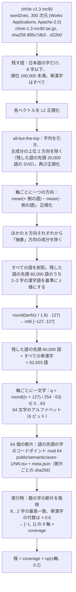

# 意味：`axes-1` の表

生成器は、題の意味を九つの数として読む。この数は、日本語の単語ベクトルのファイルから一度だけ作ってサイトに同梱した、固定の表から引く。紙面を作るときにモデルは動かず、リクエストごとの計算もない。一度公開した表は変えない。`axes-1` は v1 の一部である。

意味は絵として描かない。意味が決めるのは強さだけである。行為の強さ、題を何回書くか、紙面の大きさと位置、素材の量を動かし、字や記号や関連語を紙面に足すことはない（[composition.md](composition.md)）。



## 1. 表を作る（`tools/semantic/axes.py`）

入力は `chive-1.3-mc90.tar.gz`（sha256 `885c7db3b8cd8ad1311ac32eafc874007f45010791b3c1f1e934a2aa0c7d22b0`）の中にあるテキスト形式のベクトルで、一行ずつ読む（一行目はヘッダ）。

**語彙。** すべての字が U+3040–30FF、CJK の U+4E00–9FFF か U+3400–4DBF、々、ー のどれかで、8 字以下、ファイル内の行の順位が 160,000 未満の語を残す。単漢字は順位にかかわらず残す。順序はファイルの順（頻度順）のままにする。

**共通方向の補正。** 残した語のベクトルをそれぞれ L2 正規化したものを `E` として、次の処理をする。

```
E ← E − mean(E)
V ← E[0:20000] の右特異ベクトル              （numpy による厳密な SVD）
E ← E − (E · V[0:2]ᵀ) · V[0:2]                 主成分の上位 2 方向を除く
E ← E / ‖E‖                                    行ごとに
```

これは「all-but-the-top」（Mu & Viswanath 2018）と呼ばれる処理である。こうしたベクトル空間の平均と最も強い方向は、意味よりも頻度や品詞を表しやすいので取り除く。

**軸。** 各軸は、両端の極ごとに名詞を七つずつ選んで作る（`axes.py` の `AXES`）。どれも検証用の題の語ではないので、表が 孤独 や 群衆 をどう読むかは、表に教えたものではない。

| 軸 | − 側 | + 側 |
| --- | --- | --- |
| multitude | 孤立 単独 独り 一人 個人 唯一 一個 | 集団 大勢 群れ 人々 大衆 多数 大群 |
| agitation | 静けさ 平穏 静止 無音 安らぎ 凪 平静 | 喧騒 騒ぎ 騒音 動揺 狂乱 混乱 嵐 |
| enclosure | 広がり 広野 開放 大空 海原 野原 地平線 | 閉鎖 密室 檻 壁 箱 牢獄 囲い |
| severance | 結合 絆 繋がり 融合 結束 結び目 連結 | 亀裂 分裂 決別 隔たり 断裂 裂け目 分離 |
| vanishing | 存在 実在 永続 残存 実体 確信 定着 | 消滅 消失 忘却 幻影 虚無 霧散 空虚 |
| distance | 身近 近所 隣 手元 間近 足元 傍ら | 彼方 遠方 果て 地平 遥か 異国 辺境 |
| weight | 羽毛 浮遊 軽さ 飛翔 綿毛 泡 風船 | 重さ 重圧 鉛 沈下 重量 岩盤 鉄塊 |
| descent | 上昇 日の出 光明 晴天 高揚 頂上 天空 | 下降 墜落 暗闇 日没 沈没 奈落 底 |
| abstraction | 石 机 皿 靴 箸 鍋 椅子 | 概念 観念 意義 理念 原理 抽象 論理 |

軸ごとに `d = mean(E[+ 側の語]) − mean(E[− 側の語])` を求めて正規化する（語彙にない語は飛ばし、ビルドのログに記録する）。

**直交化で、何をして何をしないか。** 抽象（abstraction）の方向を `a` として、ほかの八つの方向をそれぞれ `a` と直交させる。

```
d ← d − (d · a) a,   d ← d / ‖d‖        abstraction 以外のすべての軸について
```

直交化はこれだけである。**八つの軸どうしは直交させない**ので、互いに相関することがある（たとえば multitude と agitation は、共通の成分をもってよい）。この処理を入れたのは、そうしないと抽象度がすべての軸に漏れ込むからだ。抽象名詞は、抽象的だというだけで、存在 より 消滅 に、手元 より 彼方 に近くなってしまう。

**正規化。** 軸ごとに、残した語の先頭 60,000 語のうち、2–3 字ですべて漢字（か 々）の語を `R` として、次のように求める。

```
raw = E · d
z   = (raw − mean(raw[R])) / std(raw[R])
t   = round(tanh(z / 1.6) · 127)           int8 として [−127, 127] で保存
```

語の位置は、助詞や動詞の中ではなく、ふつうの熟語（題の多くはこれにあたる）の中でどれだけ珍しいかで決まる。tanh で、分布の裾を範囲の内側に収める。

出力は `axes-table.npy`（int8、語数 × 9）と `axes-words.json`（語と、軸の両端の語）である。

## 2. 保存の形式（`tools/semantic/shard.py`）

**選ぶ語。** 残した語の先頭 60,000 語と、すべての単漢字（Unicode U+4E00–9FFF、U+3400–4DBF）。合わせて 62,653 語になる。

**量子化：int8 → 6 ビット。** int8 の値 `t ∈ [−127, 127]` を 64 段階に量子化し直し、一文字で書く。

```
q      = round((t + 127) / 254 · 63)         Python の round（偶数への丸め）、q ∈ 0…63
letter = "0123456789ABCDEFGHIJKLMNOPQRSTUVWXYZabcdefghijklmnopqrstuvwxyz-_"[q]
```

軸ひとつにつき ASCII 一文字（6 ビット）で済む。int8 の値はビルドの途中にだけ現れ、配布しない。実行時には一文字を次の値に戻す。

```
v = q / 63 · 2 − 1   ∈ [−1, 1]               刻み 2/63 ≈ 0.032
```

つまり、`v ≈ t / 127 = tanh(z / 1.6)` が量子化の一刻み以内で成り立つ。

**断片。** 一行は `語<TAB>九文字` である。語は `ord(先頭の字) mod 64` の断片に入れ、`public/semantic/axes-1/NN.tsv`（`00`–`63`、圧縮後それぞれ 8–17 KB）として書き出す。`meta.json` には、表の id、軸、語数、符号化の方法、元ファイルの sha256、作り方、各断片の sha256 を記録する。同じ場所に `LICENSE-chiVe.txt` と `NOTICE.txt`（Apache-2.0）を置く。

**作り直し。** 同じ chiVe のファイルから `axes.py`、`shard.py` の順に実行すると、ビット単位で同一の断片ができる（`meta.json` と照合できる）。

```
python tools/semantic/axes.py chive-1.3-mc90.tar.gz <work-dir>
python tools/semantic/shard.py <work-dir> public/semantic/axes-1 axes-1
```

表を変えるときは、新しい id、新しいディレクトリ、新しい公開版の生成器にする。

## 3. 題を読む（`src/language/semantic/`）

`readMeaning(title)`（`load.ts`）は、次のように動く。

1. 題の空白以外の字ごとに、断片 `codePoint mod 64` を決める。題の中で読める語は、どれも題のどこかの字から始まるからだ。断片はサイトから取得し（`/semantic/axes-1/NN.tsv`）、訪問のあいだメモリに残す。取得に失敗した断片は残さないので、次の詩でもう一度取りに行く。
2. **断片をひとつでも読めなければ、`readMeaning` は例外を投げ、紙面は書かない。** 意味を欠いた紙面は、同じアドレスにある別の詩になってしまうので、代わりの処理は用意していない。
3. 取得した断片をまとめて解析し（`parseTable`）、`meaningOf(title, table)`（`axes.ts`）で読む。

`meaningOf` は題のコードポイントを順にたどる（**読みは使わない**）。

```
各位置 i について：
  空白、句読点、記号、数字（\p{P} \p{S} \p{N}）は飛ばす。数えもせず、読みもしない
  for len = min(8, 残り) … 2:
    w = chars[i : i+len]
    w がすべてひらがなで len ≤ 2 なら飛ばす          （助詞、語尾）
    w が表にあれば：sums += v(w) · len;  weight += len;  covered += len;  content += len;  i += len;  次の i へ
  どれもなければ：                                     （ここから始まる 2 字以上の語がない）
    content += 1
    chars[i] が表にある漢字なら：sums += v(c) · 0.6;  weight += 0.6;  covered += 0.6
    i += 1
axes     = sums / weight                  （何も読めなければ、すべて 0 で coverage も 0）
coverage = min(1, covered / max(1, content))
```

表にない語は、次の順で扱う。まず表にある最も長い語を探す。どの語にも含まれない漢字は、単漢字として重み 0.6 で読む（群衆 が表になければ 群 と 衆 として読む）。どの語にも含まれないかなやその他の字は、`content` を増やすだけで何も読まないので、`coverage` が下がる。一字だけの漢字の題は単漢字としてだけ読まれるので、coverage は 0.6 になる。

## 4. 軸から極へ

`src/poem/parametric/acts.ts` の規則は、すべて `poles()` を通して意味を読む。どの極も [0, 1] の値である。

```
up(x)  = clip((x − 0.2) / 0.8, 0, 1)       語が 0.2 を超えて傾かないと、何も起こらない
k      = coverage
alone   = k · up(−multitude)    many    = k · up(+multitude)
still   = k · up(−agitation)    stirred = k · up(+agitation)
open    = k · up(−enclosure)    closed  = k · up(+enclosure)
joined  = k · up(−severance)    severed = k · up(+severance)
lasting = k · up(−vanishing)    fading  = k · up(+vanishing)
near    = k · up(−distance)     far     = k · up(+distance)
light   = k · up(−weight)       heavy   = k · up(+weight)
rising  = k · up(−descent)      falling = k · up(+descent)
thing   = k · up(−abstraction)  idea    = k · up(+abstraction)
```

極が効く場所は次のとおりで、詳しくはすべて [composition.md](composition.md) に書く。

- 行為の配分（split、spread、gather、withdraw、erode、lean、crowd）
- 行の数
- 紙面の大きさ（`press`）、位置と向き（`sink`）
- 素材の置き方と量

これとは別に、題がどれだけ傾いているかで、紙面の `potential` を引き上げる。`potential = max(primary.poeticPotential, 0.3 + 0.45 · coverage · max|axis|)` である。十八の極のうち、`lasting`、`near`、`light`、`thing`、`idea` は計算するが、どの規則も読まない。そのため抽象の軸が紙面に届くのは、`potential` の中の `max|axis|` を通してだけになる。抽象の軸のおもな役割は表を作る段階にあり、ほかの八つの軸をこれと直交させるために使う。
